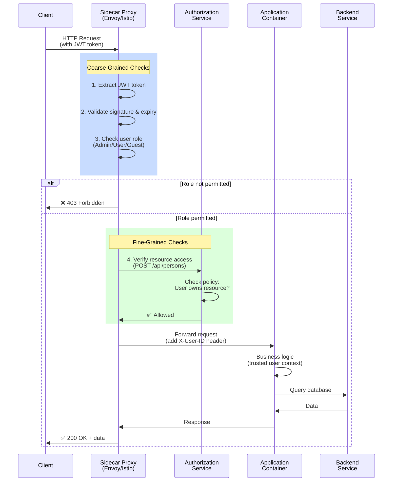
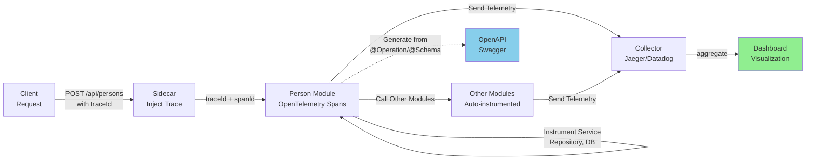

# Multi-Module Spring Boot Project

## Architecture, Build Automation & Observability

---

## Agenda

1. **Project Structure & Gradle Multi-Module Setup**
2. **Developer Experience: Pre-built Gradle Plugins**
3. **Testing & Code Quality (JaCoCo, SonarLint)**
4. **Containerization & Docker Automation**
5. **Sidecars: Authentication & Authorization Flow**
6. **Observability: OpenTelemetry & OpenAPI Integration**

---

## 1. Project Structure Overview

### Monorepo Organization

```
multi-module/
├── build.gradle.kts          # Centralized root config
├── settings.gradle.kts       # Module declarations
├── gradle/libs.versions.toml  # Version catalog
├── buildSrc/                  # Convention plugins & utilities
├── person/                    # Domain module (new)
├── example-lib/               # Library module
├── example-b-lib/             # Library module
└── example-c-lib/             # Library module
```

### Key Benefits

✅ **Unified Dependency Management** — Version catalog (libs.versions.toml) ensures all modules use consistent dependency versions
✅ **Code Reuse** — Shared Gradle convention plugins (docker, sonar, jacoco)
✅ **Consistent Build** — All modules inherit Spring Boot, Java 21, and testing frameworks
✅ **Simplified Publishing** — Single `publishAllToMavenLocal` command publishes all modules

---

## 2. Convention Plugins: Built-in Developer Experience

### What Are Convention Plugins?

Pre-built Gradle plugins in `buildSrc/src/main/kotlin/` that **eliminate boilerplate** across all modules:

- **`docker.gradle.kts`** → Docker image generation & registry tagging
- **`sonar.gradle.kts`** → Local SonarLint scanning with check automation
- **`consolidatedJacoco.gradle.kts`** → Test coverage aggregation & reporting
- **`spring-boot-application.gradle.kts`** → Spring Boot + Testing setup
- **`versions.gradle.kts`** → Git-based versioning automation

### Applied at Root Level

```kotlin
plugins {
    id("spring-boot-application")  // Applies Spring + Dependencies
    id("docker")                   // Docker automation
    id("versions")                 // Git-based versioning
}
```

→ **Every module inherits these automatically** — no repeated configuration!

---

## 2a. Docker Plugin Deep Dive

### Automated Dockerfile Generation

The `docker.gradle.kts` convention plugin:

1. **Generates Dockerfile** from a JRE template

   - Supports multi-stage builds (build stage + runtime stage)
   - Uses distroless base images for minimal attack surface

2. **Configurable via Properties**

   ```properties
   docker.buildBaseImage=eclipse-temurin:21-jdk-jammy
   docker.runtimeBaseImage=gcr.io/distroless/base-debian12:nonroot
   docker.imageName=multi-module
   docker.imageTag=latest
   docker.registry=myregistry.io
   ```

3. **Provides Ready-to-Use Tasks**
   - `./gradlew generateDockerfile` → Create/update Dockerfile
   - `./gradlew dockerBuildImage` → Build image locally
   - `./gradlew dockerTagImage` → Tag & push to registry

**Result:** Teams never hand-craft Dockerfiles; standardized, reproducible builds! 🐳

---

## 3. Testing & Code Quality

### JaCoCo: Code Coverage Enforcement

The `consolidatedJacoco.gradle.kts` plugin provides:

✅ **Aggregate Coverage Reports**

- HTML + XML reports across all modules
- Located at `build/reports/jacoco/aggregate/html`

✅ **Coverage Verification Gates**

- **Line Coverage Minimum: 80%**
- **Branch Coverage Minimum: 80%**
- Build fails if thresholds not met

✅ **Unified Test Report**

- `./gradlew aggregateTestReport` → Single HTML dashboard of all tests
- Path: `build/reports/tests/aggregate/index.html`

### SonarLint: Local Quality Scanning

The `sonar.gradle.kts` plugin:

- Runs **local SonarLint analysis** (no SonarQube server needed)
- Detects code smells, security hotspots, bugs
- Wired into `check` task → runs automatically during CI/CD
- Output: Reports on console + IDE integration

---

## 3a. Running Quality Checks

### Local Developer Workflow

```bash
# Run tests + measure coverage
./gradlew test

# Generate aggregate JaCoCo report
./gradlew aggregateJacocoReport
open build/reports/jacoco/aggregate/html/index.html

# Run SonarLint analysis
./gradlew check

# Generate test report
./gradlew aggregateTestReport
open build/reports/tests/aggregate/index.html
```

### CI/CD Integration

```bash
# Single command: test + verify coverage + SonarLint
./gradlew check aggregateJacocoReport aggregateTestReport
```

**If any test fails or coverage < 80% → build fails** ❌

---

## 4. Helm & Deployment Readiness

### Infrastructure-as-Code Integration

The project is **production-ready** for Kubernetes deployments:

✅ **Multi-stage Docker builds** → Minimal image size (distroless base)
✅ **Configurable base images** → Easy base image updates across all modules
✅ **Version management** → Git-based semantic versioning
✅ **Registry support** → Push to any registry (ECR, Docker Hub, private, etc.)

### Helm Values Generation (Future)

Can be extended to auto-generate `values.yaml` for Helm charts:

```yaml
# Automatically derived from Gradle config
image:
  repository: myregistry.io/multi-module
  tag: v1.0.1
resources:
  limits:
    memory: 512Mi
  requests:
    memory: 256Mi
```

**One source of truth**: Gradle version → Docker image tag → Helm values

---

## 5. Sidecars: Authentication & Authorization

### What is a Sidecar Pattern?

A **sidecar** is a container deployed alongside your application pod that:

- Intercepts all network traffic (both inbound & outbound)
- Handles cross-cutting concerns without modifying app code
- Examples: Istio sidecar proxy, authentication gateway, circuit breaker

### Authentication & Authorization Interception Flow

---


```mermaid
sequenceDiagram
    participant Client
    participant SideCar as Sidecar Proxy<br/>(Envoy/Istio)
    participant AuthZ as Authorization<br/>Service
    participant App as Application<br/>Container
    participant Backend as Backend<br/>Service

    Client->>SideCar: HTTP Request<br/>(with JWT token)

    rect rgb(200, 220, 255)
    Note over SideCar: Coarse-Grained Checks
    SideCar->>SideCar: 1. Extract JWT token
    SideCar->>SideCar: 2. Validate signature & expiry
    SideCar->>SideCar: 3. Check user role<br/>(Admin/User/Guest)
    end

    alt Role not permitted
        SideCar->>Client: ❌ 403 Forbidden
    else Role permitted
        rect rgb(220, 255, 220)
        Note over SideCar,AuthZ: Fine-Grained Checks
        SideCar->>AuthZ: 4. Verify resource access<br/>(POST /api/persons)
        AuthZ->>AuthZ: Check policy:<br/>User owns resource?
        AuthZ->>SideCar: ✅ Allowed
        end

        SideCar->>App: Forward request<br/>(add X-User-ID header)
        App->>App: Business logic<br/>(trusted user context)
        App->>Backend: Query database
        Backend->>App: Data
        App->>SideCar: Response
        SideCar->>Client: ✅ 200 OK + data
    end
```

---

## 5a. Sidecar Implementation Benefits

### Decoupled Authentication from Application Code

```java
// Application code stays SIMPLE
@RestController
public class PersonController {
    @PostMapping("/api/persons")
    public ResponseEntity<PersonDto> create(
        @RequestHeader(name = "X-User-ID") String userId,
        @Valid @RequestBody PersonDto dto) {
        // userId already validated by sidecar
        // Create person for this user
        return ResponseEntity.status(HttpStatus.CREATED).body(dto);
    }
}
```

### Coarse-Grained vs Fine-Grained Control

| Coarse-Grained                 | Fine-Grained                          |
| ------------------------------ | ------------------------------------- |
| Who can access `/api/persons`? | Who can create a person in dept X?    |
| JWT token validity             | Resource ownership & org hierarchy    |
| Role-based checks              | Attribute-based access control (ABAC) |
| Sidecar enforces               | Sidecar + AuthZ service enforce       |

### Enterprise Benefits

✅ **Zero-trust networking** → Every request authenticated
✅ **Reduced attack surface** → Auth logic outside app
✅ **Flexible policies** → Update without redeploying app
✅ **Multi-language support** → Works for Java, Python, Go, Node services

---

## 6. Observability: OpenTelemetry & OpenAPI

### OpenTelemetry: Distributed Tracing

**What:** Automatic instrumentation of requests across all services

**How it works:**

```
Client Request
    ↓
Sidecar (injects trace context)
    ↓
Application (auto-instrumented spans)
    ├─ HTTP request
    ├─ Database query
    ├─ Cache lookup
    └─ External API call
    ↓
Backend Service
    ↓
Collector (Jaeger, Datadog, etc.)
    ↓
Visualization Dashboard
```

### Integration in Multi-Module Setup

```gradle
// buildSrc/src/main/kotlin/spring-boot-application.gradle.kts
dependencies {
    implementation("org.springframework.cloud:spring-cloud-starter-sleuth")
    implementation("io.opentelemetry:opentelemetry-api")
    implementation("io.opentelemetry.instrumentation:opentelemetry-spring-boot-starter")
}
```

**Result:** Every `person:create()` call automatically traced with:

- Trace ID + Span ID
- Latency breakdown (request → service → DB)
- Error context & stack traces

---

## 6a. OpenAPI: API Documentation & Contracts

### What is OpenAPI?

**Machine-readable API specification** (Swagger) auto-generated from code:

```java
@RestController
@RequestMapping("/api/persons")
public class PersonController {

    @PostMapping
    @Operation(summary = "Create a new person")
    @ApiResponse(responseCode = "201", description = "Person created")
    @ApiResponse(responseCode = "400", description = "Validation failed")
    public ResponseEntity<PersonDto> create(
        @Valid @RequestBody PersonDto dto) {
        ...
    }
}
```

### Integration with Multi-Module Project

```gradle
// buildSrc/src/main/kotlin/spring-boot-application.gradle.kts
dependencies {
    implementation("org.springdoc:springdoc-openapi-starter-webmvc-ui:2.0.0")
}
```

### Benefits

✅ **Swagger UI** → Auto-generated interactive API docs
✅ **API Contracts** → Enable client-side code generation
✅ **Testing** → Automated validation of API shape
✅ **API Versioning** → Track breaking changes
✅ **Security Docs** → Document auth schemes & scopes

**Accessible at:** `http://localhost:8080/swagger-ui.html`

---

## 6b. End-to-End Observability Flow


```mermaid
graph LR
    A["Client<br/>Request"]
    B["Sidecar<br/>Inject Trace"]
    C["Person Module<br/>OpenTelemetry Spans"]
    D["Other Modules<br/>Auto-instrumented"]
    E["Collector<br/>Jaeger/Datadog"]
    F["Dashboard<br/>Visualization"]

    A -->|POST /api/persons<br/>with traceId| B
    B -->|traceId + spanId| C
    C -->|Instrument Service<br/>Repository, DB| C
    C -->|Call Other Modules| D
    C -->|Send Telemetry| E
    D -->|Send Telemetry| E
    E -->|aggregate| F

    G["OpenAPI<br/>Swagger"]
    C -.->|Generate from<br/>@Operation/@Schema| G

    style F fill:#90EE90
    style G fill:#87CEEB
```

---

## Summary: Why This Architecture?

| Concern               | Solution             | Benefit                                      |
| --------------------- | -------------------- | -------------------------------------------- |
| **Build consistency** | Convention plugins   | No copy-paste Gradle configs                 |
| **Docker**            | Automated generation | Standard, reproducible images                |
| **Quality gates**     | JaCoCo + SonarLint   | 80% coverage enforced; bugs caught early     |
| **Auth/Z**            | Sidecar pattern      | Decoupled from app; reusable across services |
| **Visibility**        | OpenTelemetry        | Distributed tracing across all services      |
| **API contracts**     | OpenAPI/Swagger      | Auto-generated docs; client code generation  |

---

## Getting Started

### For Developers

```bash
# Clone and build
git clone <repo>
cd multi-module
./gradlew build

# Run quality checks
./gradlew check aggregateJacocoReport aggregateTestReport

# Generate Docker image
./gradlew dockerBuildImage

# Deploy (via Helm)
helm install my-app ./helm-chart --values build/helm-values.yaml
```

### For DevOps / Platform Teams

- **Dockerfile generated** at `./Dockerfile` (no manual maintenance)
- **JaCoCo reports** at `build/reports/jacoco/aggregate/html`
- **Test reports** at `build/reports/tests/aggregate`
- **Version auto-incremented** via Git tags
- **Helm values** ready for deployment automation

---

## Questions?

**Key Takeaways:**

✅ Convention plugins eliminate boilerplate across 10+ modules
✅ Automated Docker + Helm deployment
✅ Code quality gates (80% coverage) enforced in CI/CD
✅ Sidecar pattern decouples auth from business logic
✅ OpenTelemetry + OpenAPI provide full observability

---

# Work IQ:

•	Work IQ is described as the intelligence layer that enables Copilot and agents to understand you, your job, and your company. It understands your business workflows and relationships. It connects everything that matters inside your company, transforming it into an experience that feels effortless, powerful, and personal

# Fabric IQ
•	Fabric IQ is a workload for unifying data sitting across OneLake (including lakehouses, eventhouses, and semantic models) and organizing it according to the language of your business. The data is then exposed to analytics, AI agents, and applications with consistent semantic meaning and context.


# Foundry IQ


•	Foundry IQ intelligent knowledge layer within the Microsoft Foundry platform, designed to provide secure, enterprise-scale context for AI agents by connecting them to diverse data sources like SharePoint, Fabric, and the web, simplifying Retrieval-Augmented Generation (RAG) with smart retrieval and orchestration, and ensuring data governance for building more capable and trustworthy AI applications.
Foundry IQ helps address the challenge of providing AI agents with relevant and secure information from various business sources to ensure they can function effectively and intelligently.
