```mermaid
sequenceDiagram
    participant Client
    participant SideCar as Sidecar Proxy<br/>(Envoy/Istio)
    participant AuthZ as Authorization<br/>Service
    participant App as Application<br/>Container
    participant Backend as Backend<br/>Service

    Client->>SideCar: HTTP Request<br/>(with JWT token)

    rect rgb(200, 220, 255)
    Note over SideCar: Coarse-Grained Checks
    SideCar->>SideCar: 1. Extract JWT token
    SideCar->>SideCar: 2. Validate signature & expiry
    SideCar->>SideCar: 3. Check user role<br/>(Admin/User/Guest)
    end

    alt Role not permitted
        SideCar->>Client: ❌ 403 Forbidden
    else Role permitted
        rect rgb(220, 255, 220)
        Note over SideCar,AuthZ: Fine-Grained Checks
        SideCar->>AuthZ: 4. Verify resource access<br/>(POST /api/persons)
        AuthZ->>AuthZ: Check policy:<br/>User owns resource?
        AuthZ->>SideCar: ✅ Allowed
        end

        SideCar->>App: Forward request<br/>(add X-User-ID header)
        App->>App: Business logic<br/>(trusted user context)
        App->>Backend: Query database
        Backend->>App: Data
        App->>SideCar: Response
        SideCar->>Client: ✅ 200 OK + data
    end
```

# Multi-Module Spring Boot Project

## Architecture, Build Automation & Observability

---

## Agenda

1. **Project Structure & Gradle Multi-Module Setup**
2. **Developer Experience: Pre-built Gradle Plugins**
3. **Testing & Code Quality (JaCoCo, SonarLint)**
4. **Containerization & Docker Automation**
5. **Sidecars: Authentication & Authorization Flow**
6. **Observability: OpenTelemetry & OpenAPI Integration**

---

## 1. Project Structure Overview

### Monorepo Organization

```
multi-module/
├── build.gradle.kts          # Centralized root config
├── settings.gradle.kts       # Module declarations
├── gradle/libs.versions.toml  # Version catalog
├── buildSrc/                  # Convention plugins & utilities
├── person/                    # Domain module (new)
├── example-lib/               # Library module
├── example-b-lib/             # Library module
└── example-c-lib/             # Library module
```

### Key Benefits

✅ **Unified Dependency Management** — Version catalog (libs.versions.toml) ensures all modules use consistent dependency versions
✅ **Code Reuse** — Shared Gradle convention plugins (docker, sonar, jacoco)
✅ **Consistent Build** — All modules inherit Spring Boot, Java 21, and testing frameworks
✅ **Simplified Publishing** — Single `publishAllToMavenLocal` command publishes all modules

---

## 2. Convention Plugins: Built-in Developer Experience

### What Are Convention Plugins?

Pre-built Gradle plugins in `buildSrc/src/main/kotlin/` that **eliminate boilerplate** across all modules:

- **`docker.gradle.kts`** → Docker image generation & registry tagging
- **`sonar.gradle.kts`** → Local SonarLint scanning with check automation
- **`consolidatedJacoco.gradle.kts`** → Test coverage aggregation & reporting
- **`spring-boot-application.gradle.kts`** → Spring Boot + Testing setup
- **`versions.gradle.kts`** → Git-based versioning automation

### Applied at Root Level

```kotlin
plugins {
    id("spring-boot-application")  // Applies Spring + Dependencies
    id("docker")                   // Docker automation
    id("versions")                 // Git-based versioning
}
```

→ **Every module inherits these automatically** — no repeated configuration!

---

## 2a. Docker Plugin Deep Dive

### Automated Dockerfile Generation

The `docker.gradle.kts` convention plugin:

1. **Generates Dockerfile** from a JRE template

   - Supports multi-stage builds (build stage + runtime stage)
   - Uses distroless base images for minimal attack surface

2. **Configurable via Properties**

   ```properties
   docker.buildBaseImage=eclipse-temurin:21-jdk-jammy
   docker.runtimeBaseImage=gcr.io/distroless/base-debian12:nonroot
   docker.imageName=multi-module
   docker.imageTag=latest
   docker.registry=myregistry.io
   ```

3. **Provides Ready-to-Use Tasks**
   - `./gradlew generateDockerfile` → Create/update Dockerfile
   - `./gradlew dockerBuildImage` → Build image locally
   - `./gradlew dockerTagImage` → Tag & push to registry

**Result:** Teams never hand-craft Dockerfiles; standardized, reproducible builds! 🐳

---

## 3. Testing & Code Quality

### JaCoCo: Code Coverage Enforcement

The `consolidatedJacoco.gradle.kts` plugin provides:

✅ **Aggregate Coverage Reports**

- HTML + XML reports across all modules
- Located at `build/reports/jacoco/aggregate/html`

✅ **Coverage Verification Gates**

- **Line Coverage Minimum: 80%**
- **Branch Coverage Minimum: 80%**
- Build fails if thresholds not met

✅ **Unified Test Report**

- `./gradlew aggregateTestReport` → Single HTML dashboard of all tests
- Path: `build/reports/tests/aggregate/index.html`

### SonarLint: Local Quality Scanning

The `sonar.gradle.kts` plugin:

- Runs **local SonarLint analysis** (no SonarQube server needed)
- Detects code smells, security hotspots, bugs
- Wired into `check` task → runs automatically during CI/CD
- Output: Reports on console + IDE integration

---

## 3a. Running Quality Checks

### Local Developer Workflow

```bash
# Run tests + measure coverage
./gradlew test

# Generate aggregate JaCoCo report
./gradlew aggregateJacocoReport
open build/reports/jacoco/aggregate/html/index.html

# Run SonarLint analysis
./gradlew check

# Generate test report
./gradlew aggregateTestReport
open build/reports/tests/aggregate/index.html
```

### CI/CD Integration

```bash
# Single command: test + verify coverage + SonarLint
./gradlew check aggregateJacocoReport aggregateTestReport
```

**If any test fails or coverage < 80% → build fails** ❌

---

## 4. Helm & Deployment Readiness

### Infrastructure-as-Code Integration

The project is **production-ready** for Kubernetes deployments:

✅ **Multi-stage Docker builds** → Minimal image size (distroless base)
✅ **Configurable base images** → Easy base image updates across all modules
✅ **Version management** → Git-based semantic versioning
✅ **Registry support** → Push to any registry (ECR, Docker Hub, private, etc.)

### Helm Values Generation (Future)

Can be extended to auto-generate `values.yaml` for Helm charts:

```yaml
# Automatically derived from Gradle config
image:
  repository: myregistry.io/multi-module
  tag: v1.0.1
resources:
  limits:
    memory: 512Mi
  requests:
    memory: 256Mi
```

**One source of truth**: Gradle version → Docker image tag → Helm values

---

## 5. Sidecars: Authentication & Authorization

### What is a Sidecar Pattern?

A **sidecar** is a container deployed alongside your application pod that:

- Intercepts all network traffic (both inbound & outbound)
- Handles cross-cutting concerns without modifying app code
- Examples: Istio sidecar proxy, authentication gateway, circuit breaker

### Authentication & Authorization Interception Flow

---



---

## 5a. Sidecar Implementation Benefits

### Decoupled Authentication from Application Code

```java
// Application code stays SIMPLE
@RestController
public class PersonController {
    @PostMapping("/api/persons")
    public ResponseEntity<PersonDto> create(
        @RequestHeader(name = "X-User-ID") String userId,
        @Valid @RequestBody PersonDto dto) {
        // userId already validated by sidecar
        // Create person for this user
        return ResponseEntity.status(HttpStatus.CREATED).body(dto);
    }
}
```

### Coarse-Grained vs Fine-Grained Control

| Coarse-Grained                 | Fine-Grained                          |
| ------------------------------ | ------------------------------------- |
| Who can access `/api/persons`? | Who can create a person in dept X?    |
| JWT token validity             | Resource ownership & org hierarchy    |
| Role-based checks              | Attribute-based access control (ABAC) |
| Sidecar enforces               | Sidecar + AuthZ service enforce       |

### Enterprise Benefits

✅ **Zero-trust networking** → Every request authenticated
✅ **Reduced attack surface** → Auth logic outside app
✅ **Flexible policies** → Update without redeploying app
✅ **Multi-language support** → Works for Java, Python, Go, Node services

---

## 6. Observability: OpenTelemetry & OpenAPI

### OpenTelemetry: Distributed Tracing

**What:** Automatic instrumentation of requests across all services

**How it works:**

```
Client Request
    ↓
Sidecar (injects trace context)
    ↓
Application (auto-instrumented spans)
    ├─ HTTP request
    ├─ Database query
    ├─ Cache lookup
    └─ External API call
    ↓
Backend Service
    ↓
Collector (Jaeger, Datadog, etc.)
    ↓
Visualization Dashboard
```

### Integration in Multi-Module Setup

```gradle
// buildSrc/src/main/kotlin/spring-boot-application.gradle.kts
dependencies {
    implementation("org.springframework.cloud:spring-cloud-starter-sleuth")
    implementation("io.opentelemetry:opentelemetry-api")
    implementation("io.opentelemetry.instrumentation:opentelemetry-spring-boot-starter")
}
```

**Result:** Every `person:create()` call automatically traced with:

- Trace ID + Span ID
- Latency breakdown (request → service → DB)
- Error context & stack traces

---

## 6a. OpenAPI: API Documentation & Contracts

### What is OpenAPI?

**Machine-readable API specification** (Swagger) auto-generated from code:

```java
@RestController
@RequestMapping("/api/persons")
public class PersonController {

    @PostMapping
    @Operation(summary = "Create a new person")
    @ApiResponse(responseCode = "201", description = "Person created")
    @ApiResponse(responseCode = "400", description = "Validation failed")
    public ResponseEntity<PersonDto> create(
        @Valid @RequestBody PersonDto dto) {
        ...
    }
}
```

### Integration with Multi-Module Project

```gradle
// buildSrc/src/main/kotlin/spring-boot-application.gradle.kts
dependencies {
    implementation("org.springdoc:springdoc-openapi-starter-webmvc-ui:2.0.0")
}
```

### Benefits

✅ **Swagger UI** → Auto-generated interactive API docs
✅ **API Contracts** → Enable client-side code generation
✅ **Testing** → Automated validation of API shape
✅ **API Versioning** → Track breaking changes
✅ **Security Docs** → Document auth schemes & scopes

**Accessible at:** `http://localhost:8080/swagger-ui.html`

---

## 6b. End-to-End Observability Flow


---

## Summary: Why This Architecture?

| Concern               | Solution             | Benefit                                      |
| --------------------- | -------------------- | -------------------------------------------- |
| **Build consistency** | Convention plugins   | No copy-paste Gradle configs                 |
| **Docker**            | Automated generation | Standard, reproducible images                |
| **Quality gates**     | JaCoCo + SonarLint   | 80% coverage enforced; bugs caught early     |
| **Auth/Z**            | Sidecar pattern      | Decoupled from app; reusable across services |
| **Visibility**        | OpenTelemetry        | Distributed tracing across all services      |
| **API contracts**     | OpenAPI/Swagger      | Auto-generated docs; client code generation  |

---

## Getting Started

### For Developers

```bash
# Clone and build
git clone <repo>
cd multi-module
./gradlew build

# Run quality checks
./gradlew check aggregateJacocoReport aggregateTestReport

# Generate Docker image
./gradlew dockerBuildImage

# Deploy (via Helm)
helm install my-app ./helm-chart --values build/helm-values.yaml
```

### For DevOps / Platform Teams

- **Dockerfile generated** at `./Dockerfile` (no manual maintenance)
- **JaCoCo reports** at `build/reports/jacoco/aggregate/html`
- **Test reports** at `build/reports/tests/aggregate`
- **Version auto-incremented** via Git tags
- **Helm values** ready for deployment automation

---

## Questions?

**Key Takeaways:**

✅ Convention plugins eliminate boilerplate across 10+ modules
✅ Automated Docker + Helm deployment
✅ Code quality gates (80% coverage) enforced in CI/CD
✅ Sidecar pattern decouples auth from business logic
✅ OpenTelemetry + OpenAPI provide full observability

---
